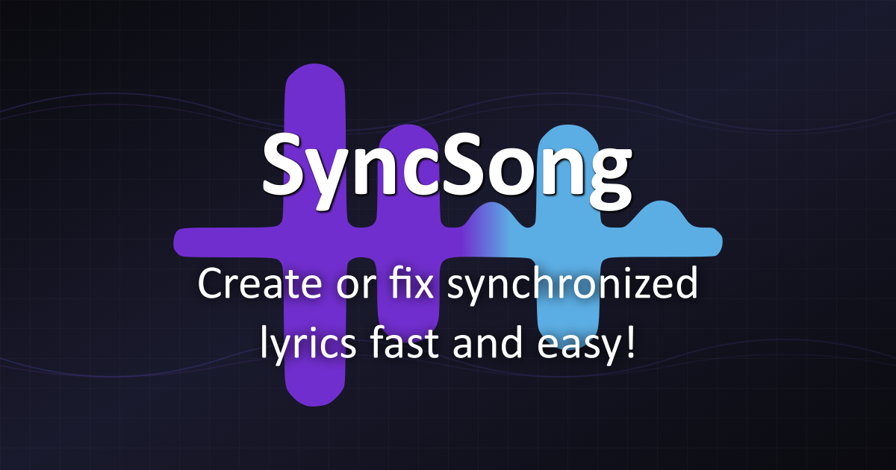

# 🎵 SyncSong

A modern web app for creating and editing synced lyrics in LRC format.

**🌐 Try it now: [syncsong.net](https://syncsong.net/)**



## Features

- **🔍 Search LRCLIB** - Find existing lyrics from the community database
- **📂 Import Lyrics** - Drag & drop LRC/TXT files or paste lyrics directly
- **🎵 Audio Support** - Works with MP3, FLAC, OGG, M4A, and WAV files
- **📊 Waveform Visualization** - See your audio with WaveSurfer.js
- **⌨️ Easy Timestamp Adjustment** - Use arrow keys to fine-tune timestamps by 0.1s
- **🔄 Auto-Sync** - Automatically generates timestamps for unsynced lyrics
- **📝 Metadata Editing** - Edit artist, album, and title information
- **💾 Multiple Export Options** - Copy to clipboard, download LRC, or publish to lrclib.net
- **📱 PWA Support** - Install as an app on your device
- **🔒 Privacy First** - Your files never leave your browser

## Quick Start

1. **Add a Song** - Drop or browse for an audio file
2. **Add Lyrics** - Search LRCLIB, import a file, or type lyrics
3. **Sync** - Click lines to jump, use ↑/↓ arrows to adjust timestamps
4. **Export** - Download, copy, or publish to lrclib.net

## Keyboard Shortcuts

| Key | Action |
| --- | ------ |
| `↑` / `↓` | Adjust timestamp by ±0.1s |
| `Space` | Play / Pause |
| `Enter` | Next line |

## Development

```bash
npm install      # Install dependencies
npm run dev      # Start dev server
npm run build    # Build for production
npm run preview  # Preview production build
```

## Tech Stack

- **Vite** - Build tool and dev server with PWA plugin
- **Tailwind CSS** - Utility-first CSS framework
- **Vanilla JavaScript** - No framework overhead
- **WaveSurfer.js** - Audio waveform visualization
- **music-metadata** - Extract metadata from audio files

## LRC Format

```lrc
[ar:Artist Name]
[ti:Song Title]
[al:Album Name]

[00:12.34]First line of lyrics
[00:15.67]Second line of lyrics
```

See [LRC File Format](https://en.wikipedia.org/wiki/LRC_(file_format)) for the full specification.

## Contributing

Contributions are welcome! The app is deployed via GitHub Actions on pushes to the `main` branch.

## License

MIT
